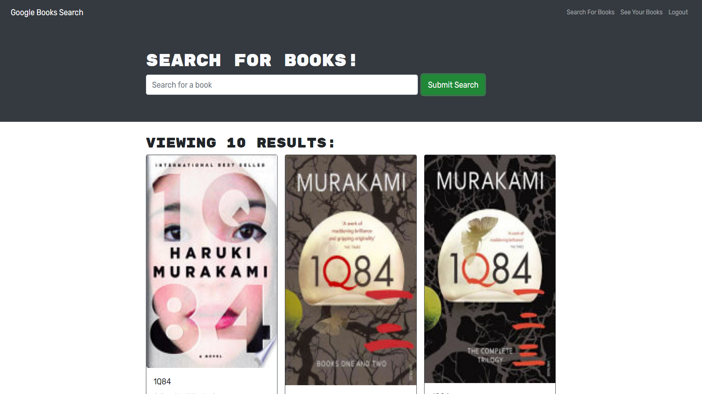
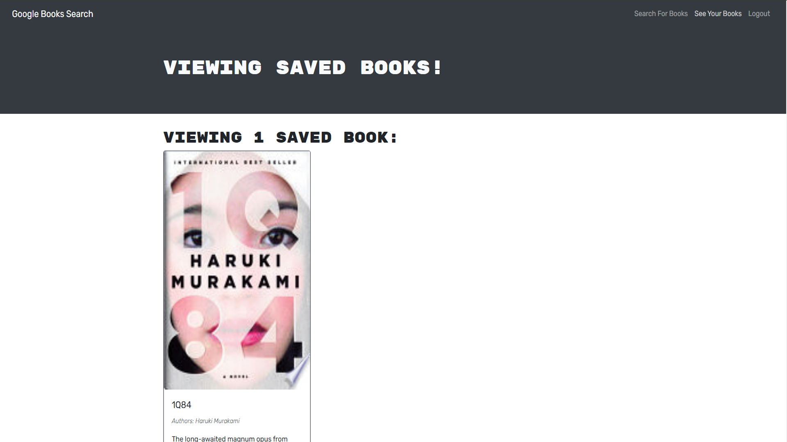

# MERN: Book Search Engine

## Description

This is a Google Books search engine built from a restful API in which I was tasked to refactor the code to become a GraphQL API on an Apollo Server. This was made possible using technologies such as 

- MERN
- React
- MongoDB
- GraphQL
- Bootstrap
- React Router

## Table of Contents

- [Installation](#installation)
- [Usage](#usage)
- [Questions](#questions)  

## Installation

To install dependencies, please use:

```
npm i 
```

## Usage

[Live Deployed Link Here](https://nameless-fortress-52666.herokuapp.com/)





## Questions

---

## Questions

You can view more of my projects at [Github](https://github.com/anguyen780)

Please contact me at anguyen780@gmail.com for additional questions!